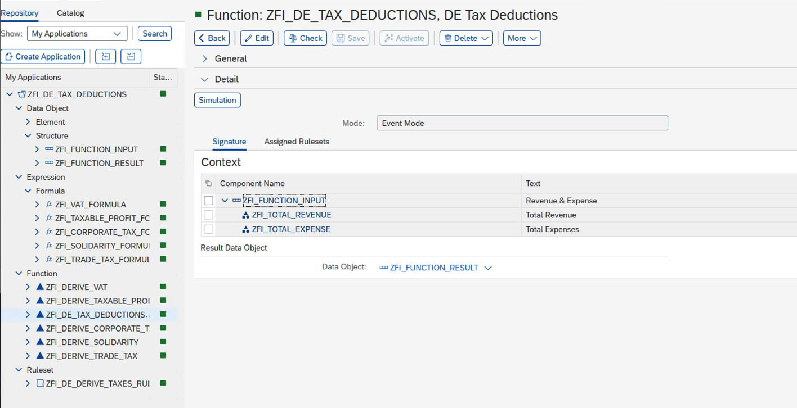

# Demo: SAP BRF Plus Application  

This repository demonstrates how to design and consume a **SAP BRF+ (Business Rule Framework Plus)** application for tax deduction calculations.  

The solution shows how to:  
- Create BRF+ data objects for input and output  
- Define formulas for VAT, Corporate Tax, Solidarity Surcharge, and Trade Tax  
- Build functions and rulesets to derive tax amounts  
- Simulate calculations in BRF+  
- Consume BRF+ logic from an ABAP program  

---

## 📖 Documentation  
Detailed steps with full screenshots are available here:  
👉 [German Tax Deduction Calculation using BRF+](docs/Documentation.md)  

---

## 🖼 Preview  

### BRF+ Function Setup  
  

### Ruleset Example  
  

👉 Full report: [src/abap/zfi_de_tax_calculation.abap](src/abap/zfi_de_tax_calculation.abap)  
👉 Helper class: [src/abap/zcl_process_brf_app.clas.abap](src/abap/zcl_process_brf_app.clas.abap)

---

## ⚖️ License  
This project is licensed under the [Apache 2.0 License](LICENSE).  
