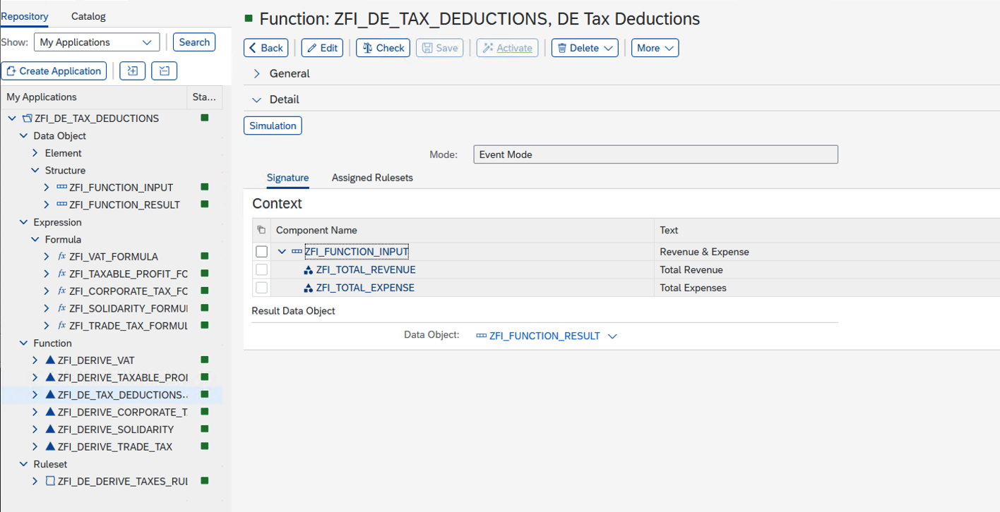
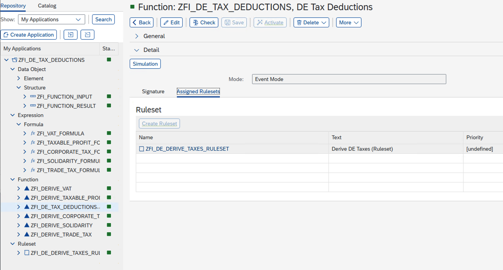
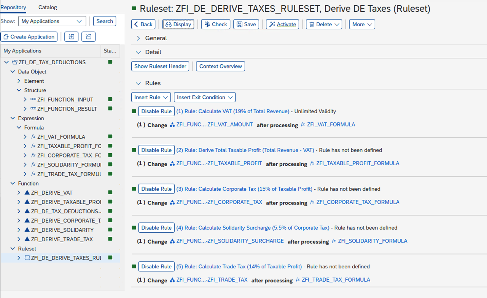
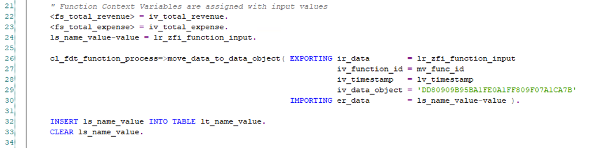
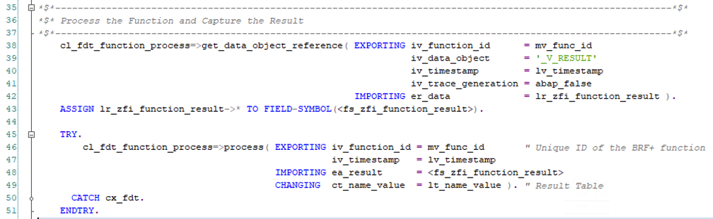
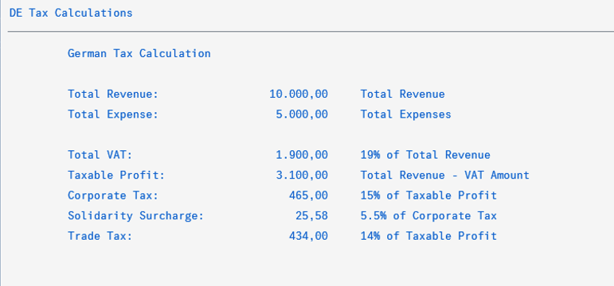

# German Tax Deduction Calculation using BRF+

## 1. Objective  
The objective of this requirement is to design and implement a tax calculation engine in BRF+ that automates the derivation of German tax deductions.  
The system should calculate VAT, Corporate Tax, Solidarity Surcharge, and Trade Tax based on financial input values.  

## 2. Scope  
    - Automate multi-step tax calculations using BRF+ formulas and rulesets.  
    - Provide flexibility to adjust tax rates and formulas without modifying ABAP code.  
    - Ensure transparency in tax calculation logic by maintaining all rules in BRF+.  
    - Support simulation and testing of tax scenarios for validation.  

## 3. Inputs  
The function will accept the following input parameters (Data Object: `ZFI_FUNCTION_INPUT`):  
    - **Total Revenue** (`ZFI_TOTAL_REVENUE`)  
    - **Total Expenses** (`ZFI_TOTAL_EXPENSE`)  

## 4. Processing Logic (Business Rules)  
The system will apply the following rules sequentially through the ruleset (`ZFI_DE_DERIVE_TAXES_RULESET`):  

    1. **Calculate VAT** → 19% of Total Revenue  
       `VAT = Total Revenue * 0.19`  
    
    2. **Derive Taxable Profit** → Total Revenue – VAT – Total Expenses  
       `Taxable Profit = Total Revenue – VAT – Expenses`  
    
    3. **Calculate Corporate Tax** → 15% of Taxable Profit  
       `Corporate Tax = Taxable Profit * 0.15`  
    
    4. **Calculate Solidarity Surcharge** → 5.5% of Corporate Tax  
       `Solidarity Surcharge = Corporate Tax * 0.055`  
    
    5. **Calculate Trade Tax** → 14% of Taxable Profit  
       `Trade Tax = Taxable Profit * 0.14`  

## 5. Outputs  
The function will return results in the output data object (`ZFI_FUNCTION_RESULT`):  
    - **VAT Amount** (`ZFI_VAT_AMOUNT`)  
    - **Taxable Profit** (`ZFI_TAXABLE_PROFIT`)  
    - **Corporate Tax** (`ZFI_CORPORATE_TAX`)  
    - **Solidarity Surcharge** (`ZFI_SOLIDARITY_SURCHARGE`)  
    - **Trade Tax** (`ZFI_TRADE_TAX`)  

## 6. Screenshots  

### Function in Event Mode  
  

### Ruleset Assigned to Function  
  

### Rules to Derive Taxes  
  

### Class and Report to Call BRF+  

### Populate Inputs into Context Variables  
  

### Process Function with Inputs  
  

### Report to Trigger BRF+  
  

### BRF+ Output  
  

